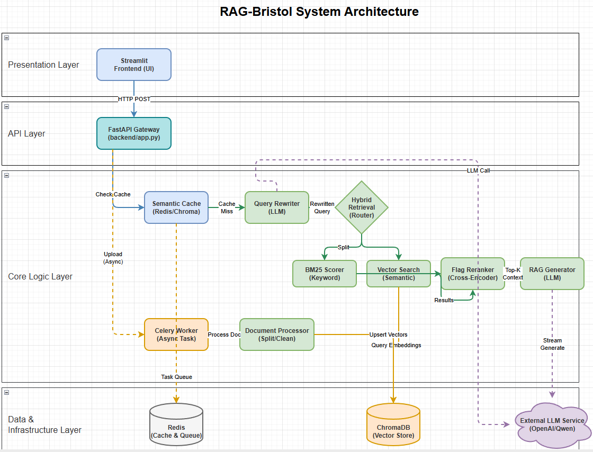
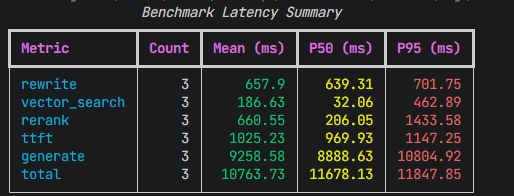

# Bristol Campus RAG System

[🇬🇧 English Version](README_EN.md)

本项目是一个检索增强生成（RAG）系统，旨在从布里斯托大学的校园通知文档中进行快速检索并生成回答。系统支持从海量 Markdown 文档中提取信息，结合大模型提供智能客服体验。

## 特性

- **交互式体验**：
  - **分阶段可视化**：在 Streamlit 界面实时展示 RAG 管道的各个阶段（查询改写、向量检索、重排序、生成）。
  - **分段请求**：用户提问后立即触发检索，检索接口可在1s内高效快速并且准确地进行基于BM25关键词匹配+向量检索的方法来匹配，检索结果返回后立即展示并继续生成总结（本地llm约5s，api约8s）。
  - **流式回答**：生成模型的回复以打字机效果实时流式输出。
  - **历史会话**：本地持久化保存会话记录，并在侧边栏以日期树状结构折叠展示，可一键恢复对话。
  - **文档查看**：检索结果支持“查看全文”，以模态框展示完整内容并支持一键复制。

- **智能检索**：
  - **语义搜索**：使用 `BAAI/bge-small-en-v1.5` 模型生成高质量文档向量，通过 ChromaDB 进行检索。
  - **查询改写**：使用 `qwen2.5:7b` 对用户查询进行优化和关键词提取。
  - **云端重排序**：集成 `BAAI/bge-reranker-v2-m3` 对初步检索结果进行二次精排，提升相关性。

- **性能优化**：
  - **语义缓存**：引入 Redis + ChromaDB 构建二级缓存机制。
  - **并发处理**：前端采用多线程并发请求，确保界面响应迅速。
  - **详细耗时统计**：提供每个处理阶段的精确耗时数据。

## 系统架构

下图展示了 Bristol Campus RAG 系统的整体架构，包括前端交互层、后端 API 服务、检索管道（向量检索 + BM25）、以及大模型生成模块：



系统采用四层架构设计：**交互层** 由 Streamlit 构建，提供聊天界面并维护会话状态，通过 HTTP 流式传输实现实时响应；**接口网关层** 基于 FastAPI，负责路由分发、数据校验与跨域处理；**核心业务层** 实现完整的 RAG 流水线——请求首先经过 Redis 语义缓存进行相似度匹配，未命中则由 LLM 进行查询重写，随后通过 BM25 关键词匹配与向量语义检索双路召回文档，经 FlagReranker 重排序后筛选 Top-K 片段，最终由 LLM 生成回答；**数据层** 包括 ChromaDB 向量数据库存储知识库片段及其向量表示，Redis 同时承担缓存与异步任务队列职责，文档摄入通过后台异步流程完成清洗、切分、向量化与入库。

## 技术栈

- **前端**：Streamlit (Python)，多阶段进度指示 + 文档卡片 + 历史会话
- **后端**：FastAPI (Python)
- **大模型**：
  - 改写 / 生成: Qwen2.5:7b（默认，共用本地 Ollama 服务），可通过配置切换为 Gemini-3-Flash
  - Embedding: BAAI/bge-small-en-v1.5
  - Rerank: BAAI/bge-reranker-v2-m3（本地或 API）
- **数据库**：
  - 向量库: ChromaDB
  - 缓存: Redis (语义缓存 + BM25/向量混合检索辅助)

## 项目结构

```
RAG-Bristol/
├── backend/            # Python FastAPI 后端
│   ├── app.py          # API 入口点
│   ├── core/           # 核心业务逻辑
│   │   ├── config.py   # 配置管理
│   │   ├── retriever.py # 检索与重排序逻辑
│   │   ├── generator.py # RAG 生成逻辑
│   │   └── ...
│   └── ...
├── streamlit_app.py    # Streamlit 前端应用
├── bristol_markdown/   # 原始 Markdown 文档数据
└── .env                # 环境变量配置文件
```


## 性能基准测试 (Benchmark)

基于 2026-01-15 的测试数据 (3次请求平均值)：

下图展示了使用 Qwen2.5:7b + BM25 混合检索方案时各阶段的延迟分布情况：



从图中可以看出：
- **向量检索 (Vector Search)** 得益于 ChromaDB 的高效HNSW索引，延迟较低在100ms左右
- **生成阶段 (Generate)** 占用了大部分时间（10秒级别），这是由于本地 LLM 推理的固有延迟
- **重排序 (Rerank)** 和 **查询改写 (Rewrite)** 是主要的可优化点


## 数据格式示例

### 向量数据库存储格式 (ChromaDB)

系统将文档切片后存储在 ChromaDB 中，每个切片包含以下字段：

```json
{
  "id": "6f0b61e9bea65b7023c5f30f8bab504e",
  "document": "> During your time in Bristol we hope you'll discover why so many choose this city to live, work and study.\n\nUniversity residences, private rented accommodation, and chief and senior residents.\n\nStay active by signing up for a student membership or book sports classes online.",
  "metadata": {
    "title": "Life in Bristol",
    "url": "https://www.bristol.ac.uk/students/life-in-bristol/",
    "date": "2026-01-11",
    "description": "Information and advice about student life in Bristol.",
    "h2": "Student societies and volunteering"
  }
}
```


### 会话历史存储格式 (chat_history.json)

前端会话历史以 JSON 格式存储在 `.streamlit/chat_history.json`，支持多轮对话和检索结果记录：

```json
{
  "id": "d9ce37288b3449cda1518e2b793815d0",
  "created_at": "2026-01-15T22:06:10",
  "updated_at": "2026-01-15T22:06:32",
  "title": "哪里可以查到最新的考试安排？",
  "messages": [
    {
      "role": "assistant",
      "content": "你好，我是校园智能助手。请输入你的问题。"
    },
    {
      "role": "user",
      "content": "哪里可以查到最新的考试安排？"
    },
    {
      "role": "assistant",
      "content": "### 关于考试安排的解答\n根据最新的校园通知 **[3]**，...\n\n---\n### 🔗 参考链接\n- [3] 如何提出申诉 [https://...]",
      "docs": [
        {
          "id": "634a49e3428f0a21e73cb67be0a67dc3",
          "content": "> How to get to exam venues off campus...",
          "metadata": {
            "title": "Off-campus exam venues",
            "url": "https://www.bristol.ac.uk/students/your_studies/exams-assessments/exam-venues/"
          },
          "score": 0.6735,
          "rerank_score": 0.0
        }
      ],
      "sources": [...]
    }
  ]
}
```


## 🚀 面向学校的企业级架构优化路线

### 1. 总体架构演进思路

目前的架构是典型的 **"单体 + 微服务雏形"**，主要瓶颈包括：

| 瓶颈类型 | 现状描述 |
|---------|---------|
| 🔴 单点故障 | API Server 和 ChromaDB 均为单实例 |
| 🔴 同步阻塞 | LLM 调用和 Rerank 计算密集型任务可能阻塞主线程 |
| 🔴 连接池限制 | 高并发下数据库和 Redis 连接数可能耗尽 |

**目标架构**: 基于 **Kubernetes (K8s)** 的云原生分布式架构。

---

### 2. 核心层级优化方案

#### 第一层：接入层与网关 (Access Layer & Gateway)

**现状**：Streamlit 直接调用 FastAPI，缺乏流量控制。

**优化方向**：

| 优化项 | 实现方案 |
|-------|---------|
| **负载均衡** | 在 API 前引入 Nginx 或云厂商 ALB/SLB，实现流量分发，支持 SSL 卸载 |
| **API 网关** | 引入 Kong 或 APISIX |
| **限流 (Rate Limiting)** | 针对不同租户或 IP 进行限流，防止恶意攻击或资源耗尽 |
| **鉴权 (Auth)** | 统一处理 JWT 认证，减轻后端压力 |
| **前后端分离** | 生产环境废弃 Streamlit（仅用于原型），改用 React/Vue 构建静态资源部署在 CDN 上，后端仅提供 REST/GraphQL 接口 |

---

#### 第二层：应用服务层 (Application Layer)

**现状**：单机 FastAPI，计算与 I/O 混合。

**优化方向**：

##### 无状态水平扩展 (Stateless Scaling)
- 将 FastAPI 服务容器化（Docker）
- 利用 K8s HPA (Horizontal Pod Autoscaler) 根据 CPU/内存使用率自动伸缩 Pod 数量

##### 异步化改造 (Full Async)
- 利用 Python `asyncio` 彻底改造 IO 密集型操作（DB 读写、LLM 请求）
- 使用 **Server-Sent Events (SSE)** 或 **WebSocket** 替代 HTTP 流式响应，保持长连接的稳定性

##### 计算分离
- **Rerank 模型微服务化**: 重排序（FlagReranker）是计算密集型任务（消耗 GPU/CPU），应将其剥离为独立的微服务
- 推荐使用 **Triton Inference Server** 或 **TorchServe** 部署，独立扩容，避免阻塞主 API

---

#### 第三层：数据与存储层 (Data & Storage Layer)

**现状**：ChromaDB 单点，Redis 用途混合。

**优化方向**：

##### 向量数据库集群化
| 方案 | 说明 |
|-----|------|
| 分布式 Chroma | 迁移至 Chroma 的分布式部署模式（Client-Server 模式） |
| 替代方案 | 迁移至 **Milvus Cluster** 或 **Qdrant**，支持分片（Sharding）和多副本（Replication） |
| 读写分离 | 建立只读副本用于高频检索请求，主节点处理数据写入（Upsert） |

##### Redis 高可用
| 方案 | 说明 |
|-----|------|
| 集群部署 | 部署 **Redis Cluster** 或 **Sentinel** 模式，确保缓存和队列的高可用性 |
| 防护策略 | 实现**布隆过滤器（Bloom Filter）** 和随机过期时间策略，防止缓存穿透/雪崩 |

---

#### 第四层：LLM 模型网关层 (Model Gateway Layer)

**现状**：直接调用外部 API，依赖单一供应商。

**优化方向**：

##### 模型路由与熔断 (Model Routing & Circuit Breaking)
- 构建统一模型网关（如利用 **LiteLLM**）
- **多供应商轮询**: 当 OpenAI 延迟高或报错时，自动降级切换到 Azure OpenAI、Anthropic 或本地部署的 Qwen/Llama 模型
- **智能重试 (Exponential Backoff)**: 针对 429 (Rate Limit) 错误实现指数退避重试

##### 语义缓存增强
- 提高 Semantic Cache 的命中率
- 对于相似度极高（如 > 0.95）的问题直接返回缓存，完全不经过 LLM
- 🎯 **预期效果**: QPS 可提升 **10-100 倍**，这是提升并发能力最有效的手段

---

```
